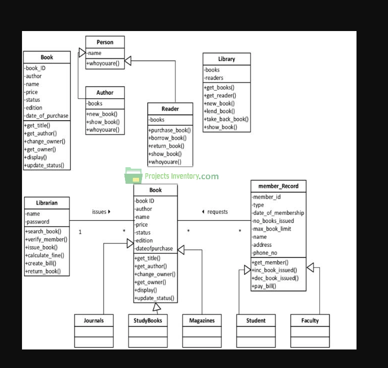

#  Java Collection Framework Challenge 

### Proje Kurulumu

Projeyi öncelikle forklayın ve clone edin.
Daha sonra projeyi IntellijIDEA kullanarak açınız. README.md dosyasını dikkatli bir şekilde okuyarak istenenleri yapmaya çalışın.
Proje sayımız ilerledikçe proje yönetimimizi kolaylaştırmak adına projelerimizi belli klasör kalıplarında saklamak işimizi kolaylaştırmak adına iyi bir alışkanlıktır.
Örnek bir Lokasyon: Workintech/Sprint_1/Etud.

### Hedeflerimiz:

### Library System

 * 
 * Bir kütüphane sistemi modelimiz mevcut.
 * Bu modeli programlamak istiyoruz.
 * Amacımız bir Kütüphane Otomasyonu dizayn etmek. Ekteki Sınıfları ve aralarındaki ilişkileri kurarak bu sistemi nasıl dizayn edebiliriz?
 * Kendi eklemek istediğiniz özellikleri eklemekten asla çekinmeyiniz.